  <picture>
    <source media="(prefers-color-scheme: dark)" srcset="./assets/generated/grid01-hero.svg">
    <source media="(prefers-color-scheme: light)" srcset="./assets/generated/grid01-hero.svg">
    
  </picture>
  <picture>
    <source media="(prefers-color-scheme: dark)" srcset="./assets/generated/grid02-commits.svg">
    <source media="(prefers-color-scheme: light)" srcset="./assets/generated/grid02-commits.svg">
    
  </picture>
  <picture>
    <source media="(prefers-color-scheme: dark)" srcset="./assets/generated/grid03-repos1.svg">
    <source media="(prefers-color-scheme: light)" srcset="./assets/generated/grid03-repos1.svg">
    
  </picture>
  <picture>
    <source media="(prefers-color-scheme: dark)" srcset="./assets/generated/grid04-repos2.svg">
    <source media="(prefers-color-scheme: light)" srcset="./assets/generated/grid04-repos2.svg">
    
  </picture>
  <picture>
    <source media="(prefers-color-scheme: dark)" srcset="./assets/generated/grid08-contact.svg">
    <source media="(prefers-color-scheme: light)" srcset="./assets/generated/grid08-contact.svg">
    
  </picture>

