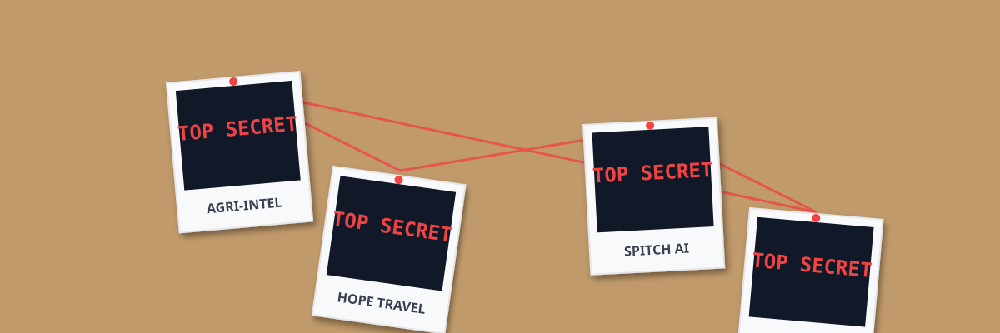
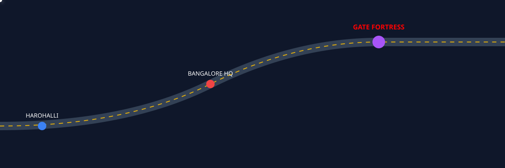
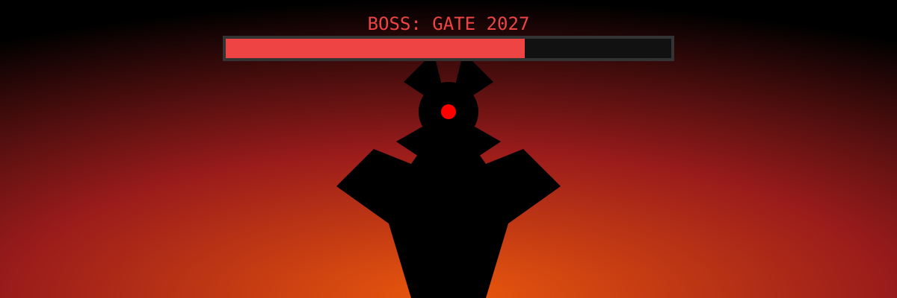
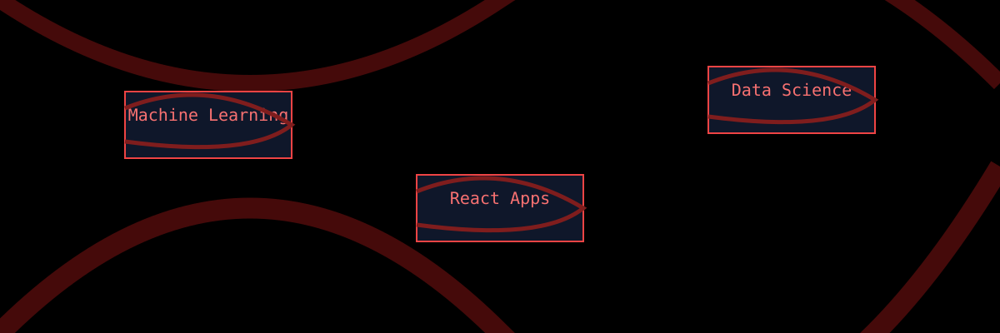
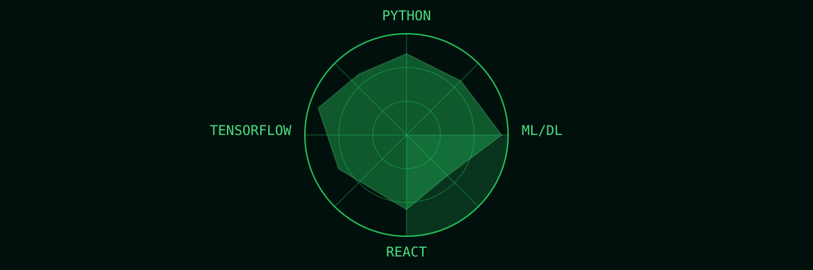
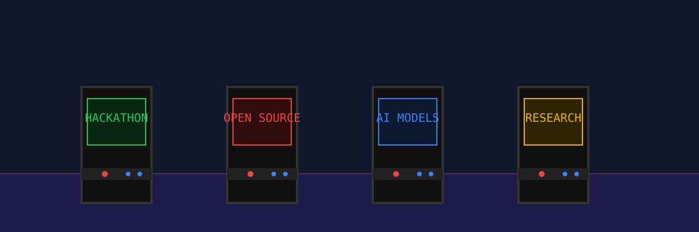

  <picture>
    <source media="(prefers-color-scheme: dark)" srcset="./assets/generated/grid01-hero.svg">
    <source media="(prefers-color-scheme: light)" srcset="./assets/generated/grid01-hero.svg">
    
  </picture>
  <picture>
    <source media="(prefers-color-scheme: dark)" srcset="./assets/generated/grid02-terminal.svg">
    <source media="(prefers-color-scheme: light)" srcset="./assets/generated/grid02-terminal.svg">
    
  </picture>
  <picture>
    <source media="(prefers-color-scheme: dark)" srcset="./assets/generated/grid03-party.svg">
    <source media="(prefers-color-scheme: light)" srcset="./assets/generated/grid03-party.svg">
    
  </picture>
  <picture>
    <source media="(prefers-color-scheme: dark)" srcset="./assets/generated/grid04-portal.svg">
    <source media="(prefers-color-scheme: light)" srcset="./assets/generated/grid04-portal.svg">
    
  </picture>
  <picture>
    <source media="(prefers-color-scheme: dark)" srcset="./assets/generated/grid05-evidence.svg">
    <source media="(prefers-color-scheme: light)" srcset="./assets/generated/grid05-evidence.svg">
    
  </picture>
  <picture>
    <source media="(prefers-color-scheme: dark)" srcset="./assets/generated/grid06-map.svg">
    <source media="(prefers-color-scheme: light)" srcset="./assets/generated/grid06-map.svg">
    
  </picture>
  <picture>
    <source media="(prefers-color-scheme: dark)" srcset="./assets/generated/grid07-boss.svg">
    <source media="(prefers-color-scheme: light)" srcset="./assets/generated/grid07-boss.svg">
    
  </picture>
  <picture>
    <source media="(prefers-color-scheme: dark)" srcset="./assets/generated/grid08-clock.svg">
    <source media="(prefers-color-scheme: light)" srcset="./assets/generated/grid08-clock.svg">
    
  </picture>
  <picture>
    <source media="(prefers-color-scheme: dark)" srcset="./assets/generated/grid09-repos.svg">
    <source media="(prefers-color-scheme: light)" srcset="./assets/generated/grid09-repos.svg">
    
  </picture>
  <picture>
    <source media="(prefers-color-scheme: dark)" srcset="./assets/generated/grid10-radar.svg">
    <source media="(prefers-color-scheme: light)" srcset="./assets/generated/grid10-radar.svg">
    
  </picture>
  <picture>
    <source media="(prefers-color-scheme: dark)" srcset="./assets/generated/grid11-arcade.svg">
    <source media="(prefers-color-scheme: light)" srcset="./assets/generated/grid11-arcade.svg">
    
  </picture>
  <picture>
    <source media="(prefers-color-scheme: dark)" srcset="./assets/generated/grid12-escape.svg">
    <source media="(prefers-color-scheme: light)" srcset="./assets/generated/grid12-escape.svg">
    
  </picture>

